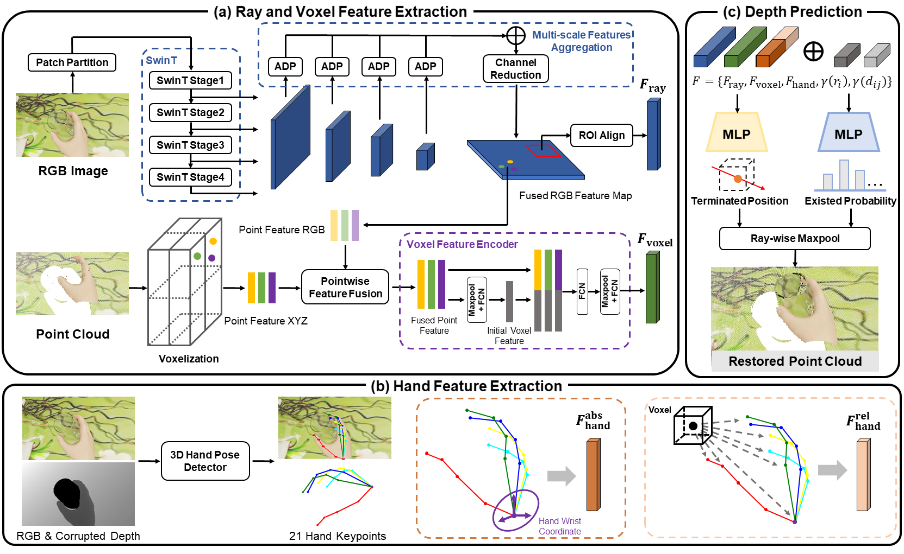

## Depth Restoration of Hand-Held Transparent Objects for Human-to-Robot Handover
This is the code implementation of **H**and-**A**ware **D**apth **R**estoration (**HADR**) proposed in ["Depth Restoration of Hand-Held Transparent Objects for Human-to-Robot Handover"](https://marcyu0303.github.io/HADR.github.io/). HADR is a novel method that can restore the depth of hand-held transparent objects by creating an implicit function from the single RGB-D image and introducing hand holding posture as an important guidance. 



## Setup
Please first install the dependencies using pip:
```bash
$ pip install -r requirments.txt
```

Since this work is currently under review, we will upload the dataset once it is accepted. Contact me if you need an early access.
After dowloading the dataset, please extract the dataset and organize it into the following structure:
```
TransHand-14K
├── train
│   ├── object_id_0
│   │   ├── depth_np
│   │   ├── depth_png
│   │   ├── hand_kpt
│   │   ├── hand_mask
│   │   ├── log_json
│   │   ├── object_mask
│   │   └── rgb
│   ├── object_id_1
│   └── ...
├── val
│   ├── object_id_0
│   ├── object_id_1
│   └── ...
└── test
    ├── object_id_0
    ├── object_id_1
    └── ...
```

## Training
Before you start training the HADR, please first train the keypoints detection model using the following command:
```bash
cd src
bash scripts/train_keypoints.sh
```
The checkpoint of the keypoints detection model will be saved in 'logs' folder. Please check its path and update it ithe train_hadr.yaml file. Then you can start training the HADR model using the following command:
```bash
bash scripts/train_hadr.sh
```
## Testing
We provide the code for testing the HADR model on the TransHand-14K dataset. You can test the HADR model using the following command:
```bash
bash scripts/test_hadr.sh
```

Code of real-world implementation and handover experiment is not included in this repository. If you are interested, please contact the [me](yur23@mails.tsinghua.edu.cn).

## Citation
If you find this work is useful in your research, please cite:

```latex
@article{yu2024depth,
  title={Depth Restoration of Hand-Held Transparent Objects for Human-to-Robot Handover},
  author={Yu, Ran and Yu, Haixin and Yan, Huang and Song, Ziwu and Li, Shoujie and Ding, Wenbo},
  journal={arXiv preprint arXiv:2408.14997},
  year={2024}
}
```

## Acknowlegement
We sincerely thank the authors of [implicit_depth](https://github.com/NVlabs/implicit_depth) and [SwinDRNet](https://github.com/rnlee1998/SwinDRNet) for open sourcing their methods.